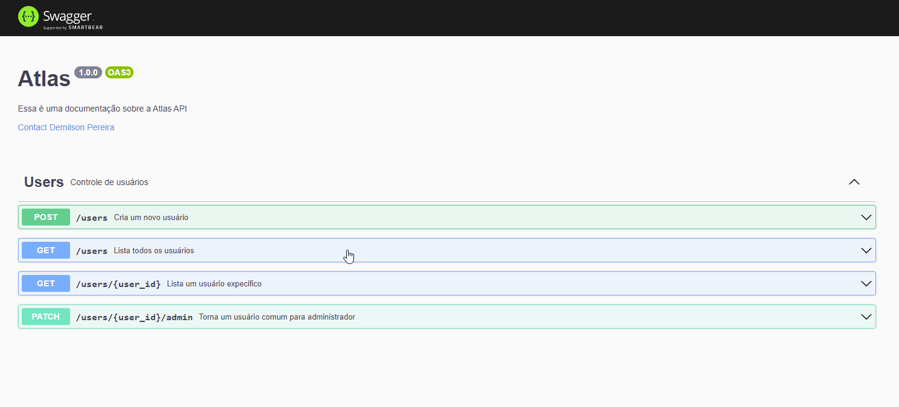

<h1 align="center">
    
</h1>

## **💻Sobre a documentação**

Este desafio tem como objetivo criar uma documentação com o Swagger para ilustrar as funcionalidades da aplicação através de testes na própria documentação.
